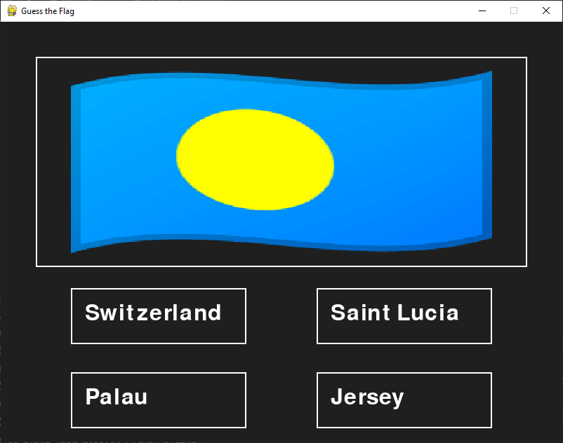

# Flag Guessing Game

A simple flag guessing game made in python with pygame. The pygame interface is not fully functional yet but you can play the simple cli version by running the `main.py` file

